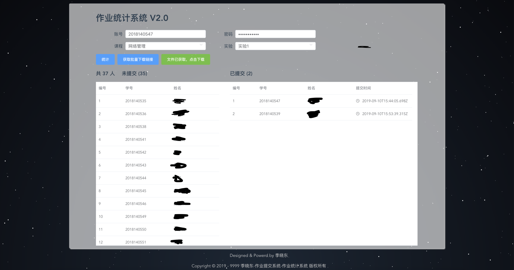
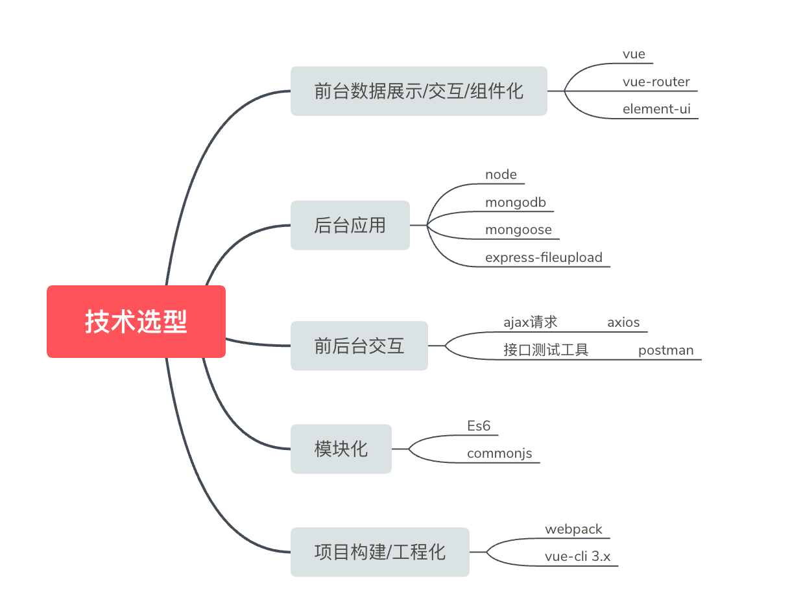

# 作业提交系统

之所以做这个系统完全是因为我懒，收作业用邮件虽然分类了，但是每次还得点开下载，选择存放位置。

而使用这个系统完全不用管，最后直接打包下载即可，还可以统计谁没交，一举两得。

## 项目描述
1. 这个一个作业系统,包括前端和后台。
2. 包括作业提交系统和作业统计系统。
3. 前端使用vue全家桶+axios+webpack等技术
4. 后端使用Node+Express+MongoDB等技术
5. 采用模块化、组件化、工程化的开发模式

## 页面UI




## 技术选型


在整个项目中也不是没有问题的
1. 压缩文件夹
2. 打包后静态资源请求404
3. VueCli3.x 如何按需加载element-ui

针对上述问题一个一个来解决
1. 压缩文件夹
打包下载时，服务器必须压缩整个文件夹，然后在网上找了个方法，使用 `archiver.js`,但是最后的结果是无法解压。后来又找了个方法，使用 `zip-local.js`，代码如下
```
    zipper.sync.zip(path).compress().save(zipFileName);
``` 
而之前的 `archiver` 要写好多代码，显然 `zip-local` 比较好。

2. 打包后静态资源请求404

在vue-cli 3.x中，首先新建一个 `vue.config.js` 文件,然后写入以下代码
```
publicPath: './',
```
3. VueCli3.x 如何按需加载`element-ui`

要在vue-cli 3.x中按需加载`element-ui`就必须在babel.config.js中，添加如下代码
```
"plugins": [
    [
      "component",
      {
        "libraryName": "element-ui",
        "styleLibraryName": "theme-chalk"
      }
    ]
  ]
```


## Project setup
```
yarn install
```

### Compiles and hot-reloads for development
```
yarn run serve
```

### Compiles and minifies for production
```
yarn run build
```

### Run your tests
```
yarn run test
```

### Lints and fixes files
```
yarn run lint
```

### Customize configuration
See [Configuration Reference](https://cli.vuejs.org/config/).

